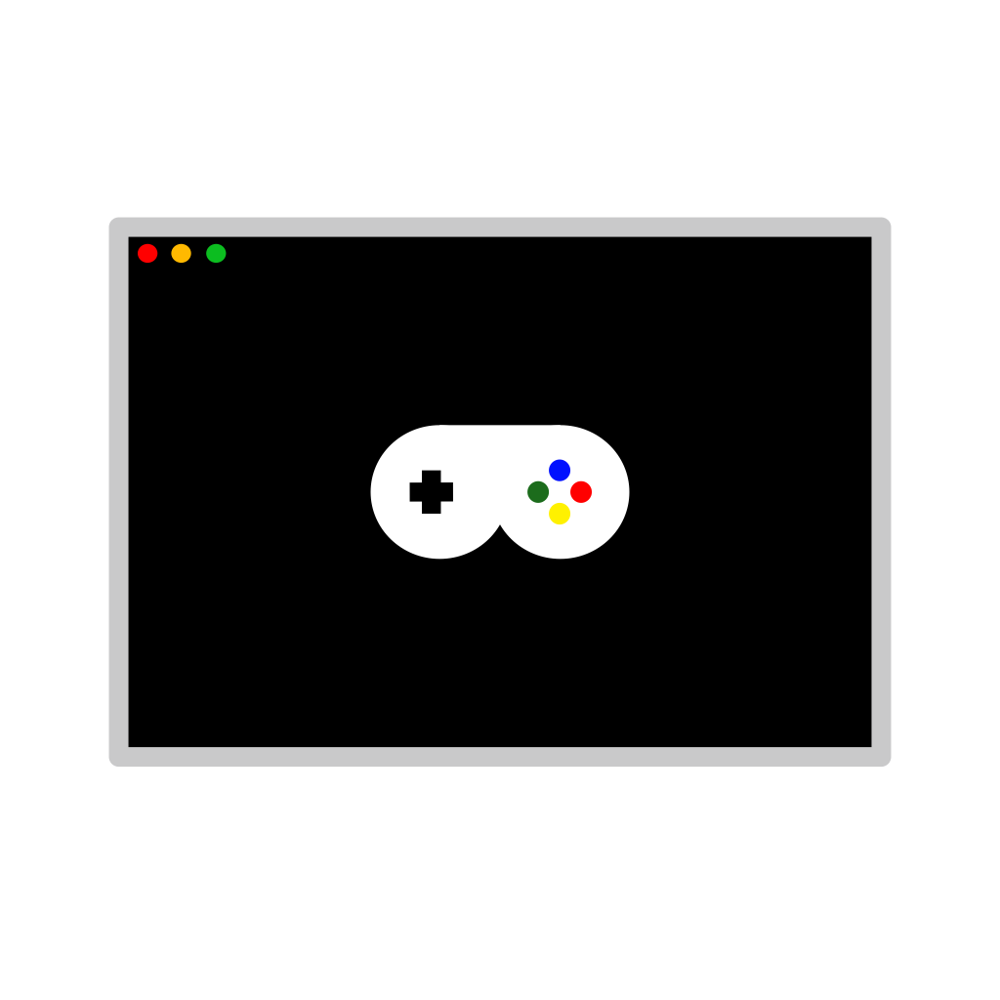

# EmuWeb

The Open Source Retro Emulation Frontend for the Web

## Requirements

- Python 3.13
- Dependencies in requirements.txt
- A SteamGridDB API Key

## Credits

The template files for everything except Flash are modified versions of files from the emulatorjs.org code editor.

Flash emulation powered by Ruffle.

Scratch emulation through TurboWarp.

All other systems use EmulatorJS.
