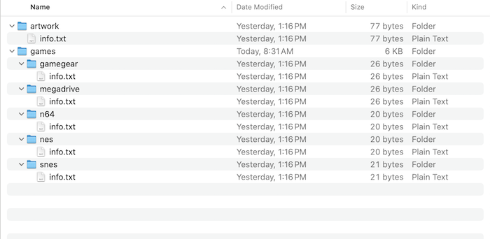

# What is EmuWeb?

EmuWeb is an open source web-based retro emulation platform. This means it is a tool that can display and run your entire library of retro games in a web browser. It currently supports Nintendo Entertainment System, Super Nintendo, Nintendo 64, Sega Megadrive/Genesis, Sega Game Gear, and Adobe Flash games. At the moment it can display artwork, but you have to import it manually. EmuWeb can be installed through docker or as a standalone program.

# Installing EmuWeb

## Installing EmuWeb using Docker (Recommended)

Start by cloning the EmuWeb Github repository in your home directory to get some necessary files:

```shell
cd ~
git clone https://github.com/DrgnFireYellow/EmuWeb.git
```

Next, delete everything in the EmuWeb folder except for the games and artwork folders. It should look something like this: 

Lastly, run this docker command to start the EmuWeb container with a web server running on port 8080:

```shell
docker run --name EmuWeb -p 8080:80 -v ~/EmuWeb/games:/EmuWeb/games -v ~/EmuWeb/artwork:/EmuWeb/artwork ghcr.io/drgnfireyellow/emuweb:stable
```

## Installing EmuWeb as a standalone application

Start by navigating to the releases tab of the [EmuWeb Github repository](https://github.com/DrgnFireYellow/EmuWeb/releases) and downloading the latest zip. 

Next, extract the zip file anywhere on your computer.

Now run the following command to install dependencies:

```shell
python3 -m pip install -r requirements.txt
```

Lastly, run main.py in the folder you just extracted and start a web server in the output folder.

# Adding Games

Navigate to the folder where you either cloned or extracted EmuWeb and open the games folder. Next, copy your legally obtained rom files into the folders for their respective systems. Lastly, either restart the docker container or run main.py again to apply your changes.

# Adding Artwork

Once again navigate to the folder where you either cloned or extracted EmuWeb, but this time open the artwork folder. Place the artwork for your games in png format in this folder named {your rom name}.png. For example, if I had a rom for Super Mario 64 called SuperMario64.z64 I would name the artwork for that rom SuperMario64.z64. Finally, restart the docker container or re-run main.py to apply your changes.
