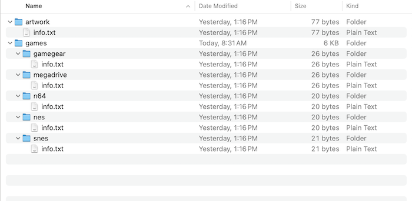

# Installing EmuWeb using Docker (Recommended)

Start by cloning the EmuWeb Github repository in your home directory to get some necessary files:

```shell
cd ~
git clone https://github.com/DrgnFireYellow/EmuWeb.git
```

Next, delete everything in the EmuWeb folder except for the games and artwork folders. It should look something like this: 

Lastly, run this docker command to start the EmuWeb container with a web server running on port 8080:

```shell
docker run --name EmuWeb -p 8080:80 -v ~/EmuWeb/games:/EmuWeb/games -v ~/EmuWeb/artwork:/EmuWeb/artwork ghcr.io/drgnfireyellow/emuweb:stable
```
